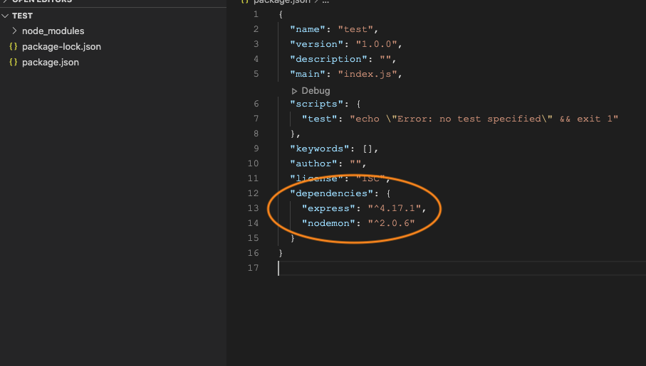
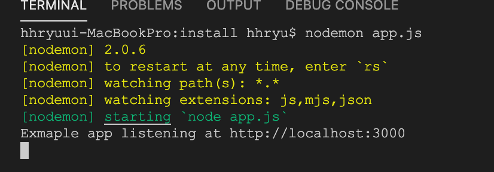
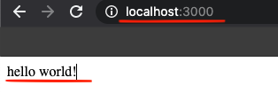

---

title: "Express.js 설치 및 기본 세팅 [Node.js]"

categories: "back-end"

tags: [back-end, node-js, express]

---


## Express로 back-end 구현하기 - Install

- Express: Node.js로 back-end구현이 가능한 open source library.


#### 1. Install

- Node.js 설치
  - https://nodejs.org/en/
- 프로젝트 및 node-module 생성

```
mkdir project-name
cd project-name

npm init -y
```

- express 및 nodemon 설치

  - nodemon: source 수정 후 server를 자동으로 재시작 해주는 package (option)

  - 제대로 설치 되었다면 아래 그림과 같이 dependencies in package.json에 추가된 것이 확인 됨.

```
npm install express nodemon --save
```




#### 2. Hello world example

##### 2-1) 구현

- project 최상위에 `app.js`파일을 생성 후 아래와 같이 코드 작성.

```javascript
// in app.js

const express = require('express')
const app = express()
const port = 3000

app.get('/', (req, res) => {
  res.send('hello world!')
})

app.listen(port, () => {
  console.log(`Example app listening at http://localhost:${port}`)
})
```

- app.get: http get method가 호출 되었을 때 즉, 사용자가 웹브라우저에서 http://localhost:3000으로 접속했을 때 `hello world!` 를 출력.
- app.listen: `3000 port` 으로 들어오는 connection을 listening하고 있음.
  - 해당 log는 server에 남겨짐.


##### 2-2) 결과

- command or terminal에서 `app.js` 를 node로 실행.

```
node app.js
// or
nodemon app.js
```



- 웹 브라우저에 `localhost:3000` 접속




#### 3. Reference

- [Express 공식 문서](https://expressjs.com/en/starter/hello-world.html)

- [전체 소스](https://github.com/hx2ryu/express-study/tree/master/install)

