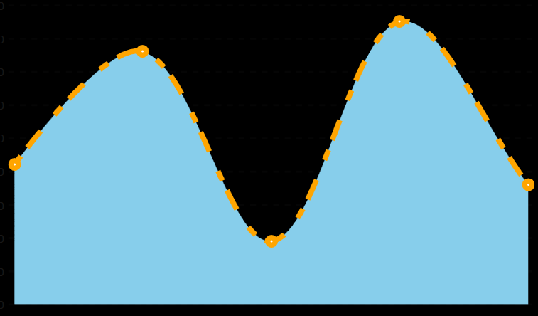
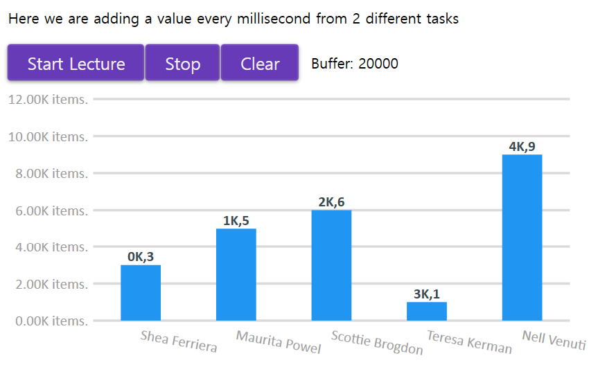

## LiveChart Library 사용법 [WPF]

#### 1. Series

##### 1-1) Stroke and Fill

```xaml
<Window xmlns:lvc="clr-namespace:LiveCharts.Wpf;assembly=LiveCharts.Wpf">
	<lvc:CartesianChart>
		<lvc:CartesianChart.Series>
			<lvc:LineSeries Fill="SkyBlue" Stroke="Orange" StrokeThickness="5" StrokeDashArray="2, 2, 4, 4"/>
		</lvc:CartesianChart.Series>
	</lvc:CartesianChart>    
</Window>
```



- StrokeThickness: 라인의 두께
- StrokeDashArray (순서대로): 
  - 첫 번째 사각형의 길이
  - 첫 번째 사각형과 다음 사각형 사이의 길이
  - 두 번째 사각형의 길이
  - 두 번째 사각형과 다음 사각형 사이의 길이


#### 2. Axes

- 축 설정 (x or y)

##### 2-1) Axes positioning

- 축의 Label 표현할 위치를 설정.

```xaml
<lvc:Axis Position="LeftBottom" />
<!-- or -->
<lvc:Axis Position="RightTop" />
```


##### 2-2) Forcing the separator Step

- Step: Label을 모두 표현하고 싶다거나, 특정 단위 간격으로 표현하고 싶을 때 사용.
  - Step="1" 은 모든 Label을 표현.

```xaml
<lvc:CartesianChart Series="{Binding SeriesCollection}">
	<lvc:CartesianChart.AxisX>
		<lvc:Axis Labels="{Binding Labels}">
			<lvc:Axis.Separator>
				<lvc:Separator IsEnabled="False" Step="1"/>
			</lvc:Axis.Separator>
        </lvc:Axis>
  	</lvc:CartesianChart.AxisX>
 	<lvc:CartesianChart.AxisY>
    	<lvc:Axis Title="Sold Items" LabelFormatter="{Binding Formatter}"/>		
	</lvc:CartesianChart.AxisY>
</lvc:CartesianChart>
```


- DateTime을 Label로 사용하는 경우 (예시: 30초 간격)

```c#
// Code behind
Step = TimeSpan.FromSeconds(30).Ticks;
```

```xaml
<!-- Xaml -->
<lvc:CartesianChart Series="{Binding SeriesCollection}">
	<lvc:CartesianChart.AxisX>
		<lvc:Axis Labels="{Binding Labels}">
			<lvc:Axis.Separator>
				<lvc:Separator IsEnabled="False" Step="{Binding Step}"/>
	        </lvc:Axis.Separator>
		</lvc:Axis>
	</lvc:CartesianChart.AxisX>
    <lvc:CartesianChart.AxisY>
		<lvc:Axis Title="Sold Items" LabelFormatter="{Binding Formatter}"/>
    </lvc:CartesianChart.AxisY>
</lvc:CartesianChart>
```


#### 3. Labels

- 각 축의 value를 설명할 때 사용.

##### 3-1) Formatted Labels

- Label의 바인딩 된 값을 그대로 보여주는 것이 아니라 그 Format을 변경하고 싶을 때 사용.
  - Chart  value or Label에 적용 가능.

```xaml
<lvc:CartesianChart>
	<lvc:CartesianChart.AxisY>
		<lvc:Axis LabelFormatter="{Binding YFormatter}"/>
	</lvc:CartesianChart.AxisY>
</lvc:CartesianChart>
```

```c#
class ViewModel
{
    public Func<double, string> YFormatter { get; set; }
    
    ViewModel()
    {
        YFormatter = (val) => $"{val}.00K items.";
    }
}
```

##### 3-2) Mapped Labels

- Label의 값을 정적으로 표시하고자 할 때, 사용.
- Axis에서 Label 우선순위: `Labels`  > `LabelFormatter` 
  - Labels가 null 일 경우에 LabelFormmatter을 참조한다.

```xaml
<lvc:CartesianChart>
	<lvc:CartesianChart.AxisX>
		<lvc:Axis Labels="Shea Ferriera, Maurita Powel, Scottie Brogdon,
                Teresa Kerman, Nell Venuti, Anibal Brothers, Anderson Dillman"/>
	</lvc:CartesianChart.AxisX>
</lvc:CartesianChart>
```

##### 3-3) Data Labels

- Chart에 value값을 표시하고 싶을 때 사용.
  - DataLabels: 표시 유/무
  - LabelPoint: 표시할 값의 Format을 바꾸고 싶을 때 사용.  (Option)

```xaml
<lvc:CartesianChart>
	<lvc:CartesianChart.Series>
		<lvc:ColumnSeries DataLabels="True" LabelPoint="{Binding LabelPointer}"/>
	</lvc:CartesianChart.Series>
</lvc:CartesianChart>
```

```c#
class ViewModel
{
	public Func<ChartPoint, string> LabelPointer { get; set; }    

    ViewModel()
    {
		LabelPointer = (val) => $"{val.Key}K,{val.Y}";        
    }
}
```

##### 3-4) Rotating Labels

- Label의 길이가 긴 경우 각 Label이 겹치지 않게  `LabelsRotation` property로 로테이션을 줄 수 있다. 

```xaml
<lvc:CartesianChart>
	<lvc:CartesianChart.AxisX>
    	<lvc:Axis LabelsRotation="190"/>
	</lvc:CartesianChart.AxisX>
</lvc:CartesianChart>
```




#### 4. Reference

- [LiveChart 공식문서](https://lvcharts.net/App/examples/wpf/start)

