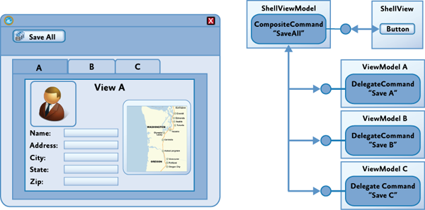

## Composite Commands in Prism Framework [WPF]

- Parent View에 있는 control의 command를 발생시켜 자식 View의 controls들의 command를 동시에 발생시키고자 할 때 사용.
- represent a group of commands `as a single command`.
- invoke multiple commands to implement a logical command.




#### 1. 구현 방법

##### 1-1) Create a Composite Command

```c#
public class ApplicationCommands
{
	private CompositeCommand _saveCommand = new CompositeCommand();
    public CompositeCommand SaveCommand
    {
    	get { return _saveCommand; }
	}
}
```

- CompositeCommand에 child를 등록 할 때,  동일한 instance를 사용해야 하므로 Singleton으로 구현되어야 한다.
- 따라서, Dependency Injection을 이용하는 방법과 static class로 정의하는 방법 2가지가 있다.


##### 1-1) Using Dependency Injection

- Interface 정의

```c#
public interface IApplicationCommands
{
	CompositeCommand SaveCommand { get; }
}
```

- Interface 구현

```c#
public class ApplicationCommands : IApplicationCommands
{
	private CompositeCommand _saveCommand = new CompositeCommand();
    public CompositeCommand SaveCommand
    {
    	get { return _saveCommand; }
	}
}
```

- container에 singleton 등록

```c#
public partial class App : PrismApplication
{
	protected override void RegisterTypes(IContainerRegistry containerRegistry)
	{
    	containerRegistry.RegisterSingleton<IApplicationCommands, ApplicationCommands>();
	}
}
```

- Composite Command 등록

```c#
public DelegateCommand UpdateCommand { get; private set; }

public TabViewModel(IApplicationCommands applicationCommands)
{
	UpdateCommand = new DelegateCommand(Update);
	applicationCommands.SaveCommand.RegisterCommand(UpdateCommand);
}
```


##### 1-2) Using static class

```c#
public static class ApplicationCommands
{
   	public static CompositeCommand SaveCommand = new CompositeCommand();
}

class TabViewModel
{
	public DelegateCommand UpdateCommand { get; private set; }

	public TabViewModel()
	{
		UpdateCommand = new DelegateCommand(Update);
		ApplicationCommands.SaveCommand.RegisterCommand(UpdateCommand);
	}
}
```


#### 2. Reference

- [Prism Library 공식 문서](https://prismlibrary.com/docs/event-aggregator.html)