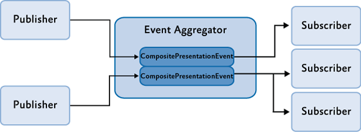

## Event Aggregator in Prism Framework [WPF]

- `Multicast` Publisher / Subscriber를 가능하게 해주는 기능.




#### 1. 구현 방법

##### 1.1) Create an Event

```c#
public class TickerSymbolSelectedEvent : PubSubEvent<string>{}
```

##### 1-2) Publisher

```c#
public class MainPageViewModel
{
    IEventAggregator _eventAggregator;
    public MainPageViewModel(IEventAggregator ea)
    {
        _eventAggregator = ea;
    }
}

public void PublishEvent()
{
	_eventAggregator.GetEvent<TickerSymbolSelectedEvent>().Publish("STOCK0");    
}
```

##### 1-3) Subscriber

```c#
public class MainPageViewModel
{
    public MainPageViewModel(IEventAggregator ea)
    {
        ea.GetEvent<TickerSymbolSelectedEvent>().Subscribe(ShowNews);
    }

    void ShowNews(string companySymbol)
    {
        //implement logic
    }
}
```


#### 2. 이벤트가 발생되어 UI를 변경하는 경우.

- Subscriber는 Publisher 스레드로부터 이벤트를 받는다.
- 만약, Publisher가 background thread일 경우 직접 UI를 변경할 수 없게 됨.
  - Dispatcher class를 사용해야 함.

```c#
public class MainPageViewModel
{
    public MainPageViewModel(IEventAggregator ea)
    {
        ea.GetEvent<TickerSymbolSelectedEvent>().Subscribe(ShowNews, ThreadOption.UIThread);
    }

    void ShowNews(string companySymbol)
    {
        //implement logic
    }
}
```

- ThreadOption
  - PublisherThread: Publisher의 Thread를 사용. (default)
  - BackgroundThread: Thread-pool로부터 받은 비동기 이벤트.
  - UIThread: UI Thread 사용.


#### 3. 일부 이벤트만 Subscribe하고 싶은 경우 (Event filtering)

- EventAggregator의 Subscriber는 Publish되는 모든 이벤트를 받게 된다. (default)
- 필요한 특정 이벤트만 Subscribe하고 싶은 경우
  - Subscribe를 등록 할 때, Predicate로 파라미터를 주어 필터링이 가능.

```c#
public class MainPageViewModel
{
    public MainPageViewModel(IEventAggregator ea)
    {
        TickerSymbolSelectedEvent tickerEvent = ea.GetEvent<TickerSymbolSelectedEvent>();
        tickerEvent.Subscribe(ShowNews, ThreadOption.UIThread, false, 
                              companySymbol => companySymbol == "STOCK0");
    }

    void ShowNews(string companySymbol)
    {
        //implement logic
    }
}
```


#### 4. Strong Reference

- 먼저, `PubSubEvent`는 weak reference와 strong reference로 subscribe 가능.
  - weak reference (default)
    -  garbage collector 허용.
  - strong reference 
    - garbage collector 허용하지 않음.
  - weak reference는 strong reference보다 performance면에서 속도가 느림.
    - 하지만 대부분의 앱에서 체감하는 performance는 미미함.
- strong reference를 구현 할 경우, garbage collector에 의해 소거되지 않으므로 직접 release 해줘야 한다.

```c#
public class MainPageViewModel
{
    public MainPageViewModel(IEventAggregator ea)
    {
        bool keepSubscriberReferenceAlive = true;
        TickerSymbolSelectedEvent tickerEvent = ea.GetEvent<TickerSymbolSelectedEvent>();
        tickerEvent.Subscribe(ShowNews, ThreadOption.UIThread, keepSubscriberReferenceAlive, 
                              companySymbol => companySymbol == "STOCK0");
    }

    void ShowNews(string companySymbol)
    {
        //implement logic
    }
}
```

- keepSubscriberReferenceAlive
  - true: strong reference
  - false (default): weak refererence


##### 5. Unsubscribe

- strongly refer 한 경우, 이벤트가 더 이상 사용되지 않을 때 직접 release해줘야 한다.

##### 5-1)  Way 1

```c#
public class MainPageViewModel
{
    TickerSymbolSelectedEvent _event;
    public MainPageViewModel(IEventAggregator ea)
    {
        _event = ea.GetEvent<TickerSymbolSelectedEvent>();
        _event.Subscribe(ShowNews);
    }

    void Unsubscribe()
    {
        _event.Unsubscribe(ShowNews);
    }

    void ShowNews(string companySymbol)
    {
        //implement logic
    }
}
```


##### 5-2) Way 2 (token 사용)

```c#
public class MainPageViewModel
{
    TickerSymbolSelectedEvent _event;
    SubscriptionToken _token;
    public MainPageViewModel(IEventAggregator ea)
    {
        _event = ea.GetEvent<TickerSymbolSelectedEvent>();
        _token = _event.Subscribe(ShowNews);
    }

    void Unsubscribe()
    {
        _event.Unsubscribe(_token);
    }

    void ShowNews(string companySymbol)
    {
        //implement logic
    }
}
```

- Subscribe method는 subscription token을 return 한다.
- subscription token가 사용되는 경우
  - 위와 같이 unsubscribe 할 때
  - subscribe 할 때 callback으로 anonymous delegate or lambda expression을 줄 경우
  - 다른 필터를 가진 동일한 event handler를 subscribe 할 때


#### 6. Reference

- [Prism Library 공식 문서](https://prismlibrary.com/docs/event-aggregator.html)

